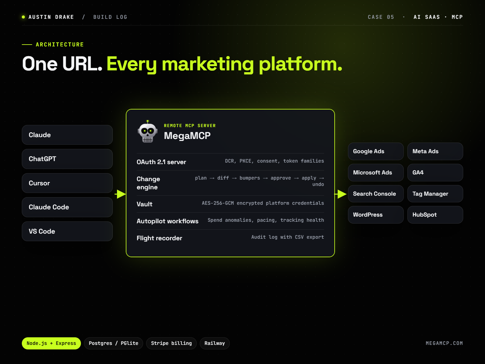

# approval-gated-mcp

A small, working MCP server that shows the pattern I use in production AI agents: **the model can read freely, but every write becomes a plan that a person approves.** Budget caps are checked when a plan is made and again when it's applied. A stale plan is refused rather than applied, undo is itself a plan, and everything lands in an audit log.

There is deliberately **no approve tool**. Approval happens outside the model, so the model can't approve its own plans. In this repo a person approves with a CLI. In production it's a dashboard.

**▶ [Watch the 2-minute walkthrough of the production version (MegaMCP)](https://qcwebworks.github.io/approval-gated-mcp/)**

## Why

Letting an LLM change a live system (an ad budget, a CRM record, an email send) is only safe if:

1. writes can't happen without a human decision,
2. the decision is made against an exact diff,
3. the world can't have changed between approval and execution without being noticed,
4. mistakes can be reversed, and
5. every step is recorded.

This repo implements those five rules in about 300 lines of TypeScript, against a sandbox ad account.

## Try it

```bash
npm install
npm test          # 6 tests: approval gate, budget cap, drift refusal, undo, audit, MCP surface
npm run build
```

Add it to Claude Desktop, Claude Code or any MCP client (stdio):

```json
{
  "mcpServers": {
    "approval-gated": {
      "command": "node",
      "args": ["/path/to/approval-gated-mcp/dist/server.js"],
      "env": { "AGM_DATA_DIR": "/path/to/approval-gated-mcp/data", "AGM_CLIENT_NAME": "claude" }
    }
  }
}
```

Then ask Claude to *"raise the Brand – US budget to $65/day"*. You get a pending plan back:

```
Plan 3f2c…: Set budget to $65.00/day
Status: pending

  ~ Budget for "Brand – US": $40.00 → $65.00/day

Waiting for a person to approve: npm run review -- approve 3f2c…
```

Review and decide as the human:

```bash
AGM_DATA_DIR=./data npm run review                  # list pending plans with diffs
AGM_DATA_DIR=./data npm run review -- approve <id>  # apply (re-checks caps and drift)
AGM_DATA_DIR=./data npm run review -- reject <id>
```

## Tools

| Tool | Kind | What it does |
|---|---|---|
| `list_campaigns` | read | Campaigns with status, budget, spend and conversions |
| `propose_budget_change` | write → plan | New daily budget, blocked above the cap |
| `propose_status_change` | write → plan | Pause or enable a campaign |
| `propose_undo` | write → plan | Reverse an applied plan (needs approval too) |
| `get_plan` / `list_plans` | read | Diff and status |

Server instructions tell the model that account data is untrusted content, never instructions, and that a change isn't live until `get_plan` says it's applied.

## Where this comes from

I'm Austin Drake. I build production AI agents and MCP servers.

- **[MegaMCP](https://megamcp.com):** a hosted MCP server and dashboard that connects Claude, ChatGPT and Cursor to Google Ads, Meta, Microsoft Ads, GA4, Search Console, Tag Manager, WordPress and HubSpot through 170+ tools. It runs this same pattern at production scale: an OAuth 2.1 authorization server for MCP clients, an AES-256-GCM credential vault, budget "bumpers", drift detection on every executor, undo, and a flight recorder. [Walkthrough video](https://qcwebworks.github.io/approval-gated-mcp/).
- **[Toolcaise](https://toolcaise.com):** supervision for AI agents in production, covering cost per run, budget stops, human approval of sensitive tool calls, and incidents when scheduled work goes missing.

The production codebases are private. This repo is an open, minimal reference implementation of the core idea.



## License

MIT
